<!-- ═══════════════════════════════════════════════════════════════════════════ -->
<!--                       EduERP NEXUS  —  README.md                          -->
<!-- ═══════════════════════════════════════════════════════════════════════════ -->

<div align="center">

<!-- HERO BANNER SVG -->


<br/>

<!-- LOGO BADGES ROW -->

&nbsp;

&nbsp;

&nbsp;

&nbsp;


<br/><br/>

<!-- TECH STACK BADGES -->

&nbsp;

&nbsp;

&nbsp;

&nbsp;

&nbsp;

&nbsp;


<br/><br/>

<!-- HEADLINE -->
### 🎓 **Enterprise-Grade ERP Platform for Modern Educational Institutions**

*A fully interactive, single-file frontend prototype featuring 15 complete modules,*
*real-time AI analytics, dark/light themes, glassmorphism UI, and zero backend required.*

<br/>

---

</div>

<!-- ═══════════════════════════════════════ -->
## 🖥️ &nbsp; Live Preview — Login Screen
<!-- ═══════════════════════════════════════ -->

<div align="center">
<br/>
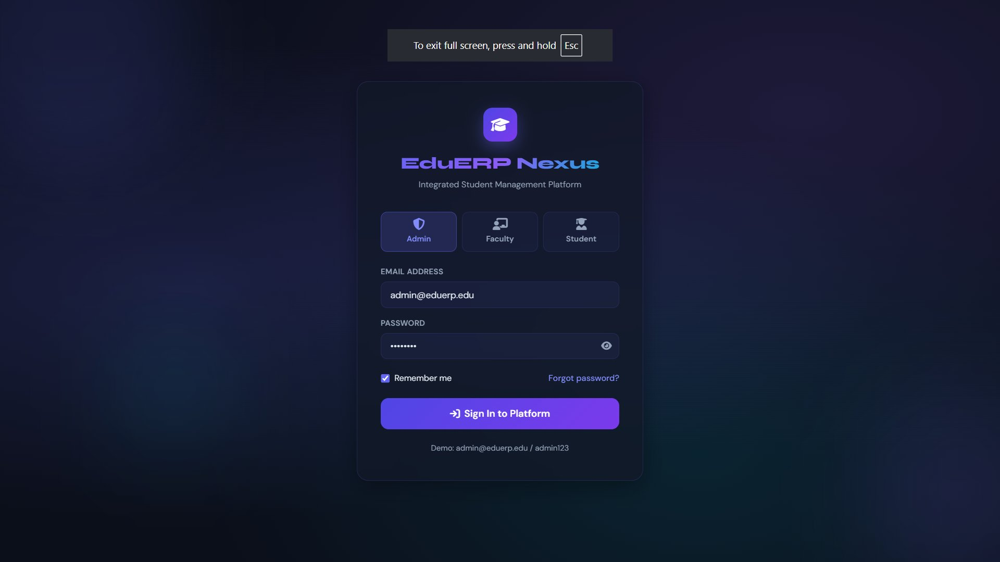
<br/><br/>

> 🔐 **Role-based authentication** · Admin / Faculty / Student modes · Password visibility toggle · Forgot password flow

<br/>
</div>

---

<!-- ═══════════════════════════════════════ -->
## 📋 &nbsp; Table of Contents
<!-- ═══════════════════════════════════════ -->

| # | Section |
|---|---------|
| 1 | [✨ Features Overview](#-features-overview) |
| 2 | [🖼️ Screenshots Gallery](#️-screenshots-gallery) |
| 3 | [🚀 Quick Start](#-quick-start) |
| 4 | [📦 Module Breakdown](#-module-breakdown) |
| 5 | [🎨 Design System](#-design-system) |
| 6 | [🧠 AI Analytics](#-ai-analytics-engine) |
| 7 | [📊 Charts & Data Viz](#-charts--data-visualization) |
| 8 | [🔧 Tech Stack](#-tech-stack) |
| 9 | [📁 Project Structure](#-project-structure) |
| 10 | [🤝 Contributing](#-contributing) |

---

<!-- ═══════════════════════════════════════ -->
## ✨ Features Overview
<!-- ═══════════════════════════════════════ -->

<div align="center">

```
╔══════════════════════════════════════════════════════════════════════╗
║          EduERP NEXUS  ·  15 Fully Interactive Modules              ║
║   Zero Backend  ·  Single HTML File  ·  Instant Browser Launch      ║
╚══════════════════════════════════════════════════════════════════════╝
```

</div>

### 🌟 Core Highlights

| Feature | Description |
|---------|-------------|
| 🎨 **Glassmorphism UI** | Premium dark/light glass cards with blur, gradients & shadows |
| 📱 **Fully Responsive** | Mobile-first design — works on desktop, tablet & mobile |
| 🌙 **Dark / Light Mode** | Persistent theme toggle with `localStorage` |
| ⚡ **Zero Dependencies** | No backend, no build step — open in any browser |
| 📊 **6 Live Charts** | Revenue, attendance, grades, AI predictions via Chart.js |
| 🤖 **AI Analytics** | Risk analysis, dropout prediction, enrollment forecast |
| 🔔 **Toast Notifications** | Real-time simulated alerts system |
| 🗃️ **CRUD Operations** | Add, Edit, Delete students/faculty with modal forms |
| 📄 **Pagination & Sorting** | Filterable, sortable data tables with page controls |
| 🖨️ **Invoice Generator** | PDF-ready fee invoice modal |
| 📡 **GPS Simulation** | Animated SVG live bus tracking map |
| 🔢 **Animated Counters** | KPI cards with smooth number animation on load |
| 📅 **Timetable Grid** | Weekly schedule with colour-coded subject cells |
| 📚 **Fine Calculator** | Library due-date fine computation |
| 🔒 **Role Selector** | Admin / Faculty / Student login modes |

---

<!-- ═══════════════════════════════════════ -->
## 🖼️ Screenshots Gallery
<!-- ═══════════════════════════════════════ -->

### 📊 Dashboard
<div align="center">
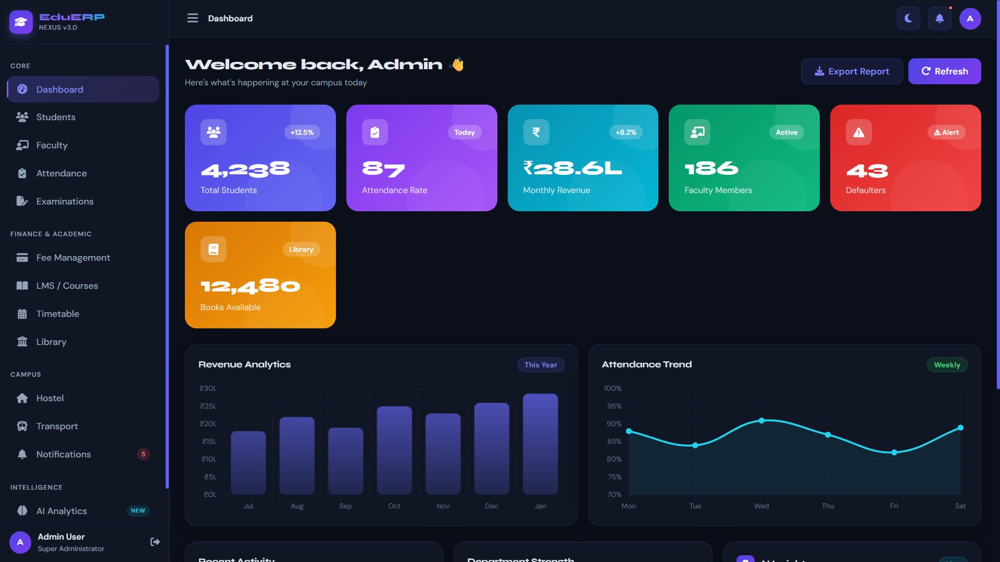
<br/><br/>

> **KPI cards** · Revenue analytics bar chart · Attendance trend line · Department donut chart · AI Insights panel · Recent activity feed

</div>

<br/>

---

### 👨‍🎓 Student Management
<div align="center">
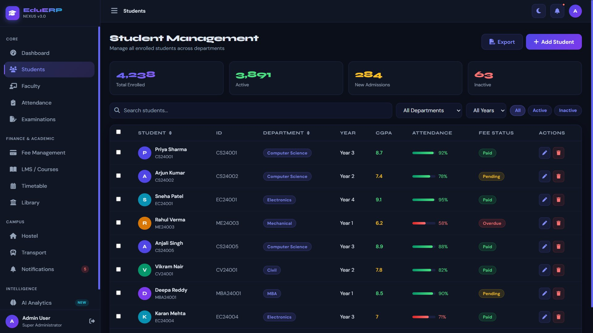
<br/><br/>

> **Search & Filter** · Sortable columns · Progress bars · Fee status badges · Edit / Delete actions · Pagination

</div>

<br/>

---

### 👩‍🏫 Faculty Management
<div align="center">
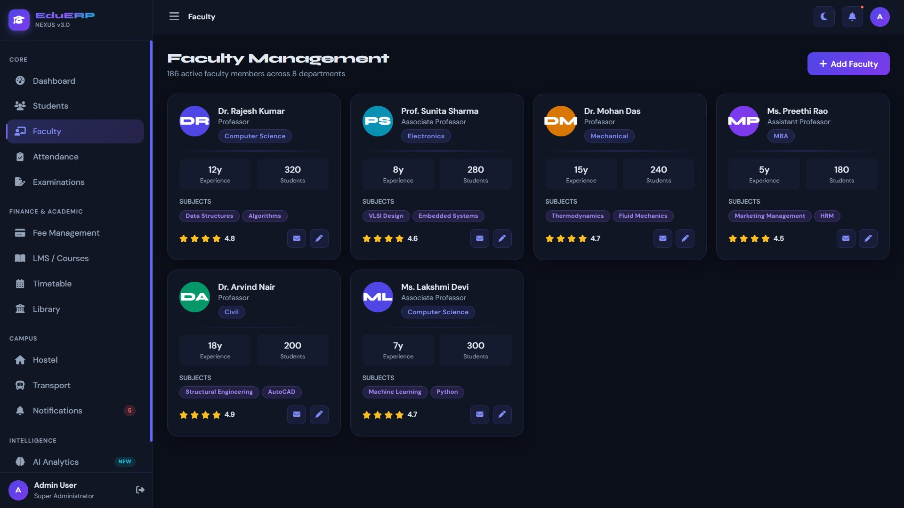
<br/><br/>

> **Faculty profile cards** · Star ratings · Subject chips · Experience & student count · Email actions

</div>

<br/>

---

### ✅ Attendance Management
<div align="center">
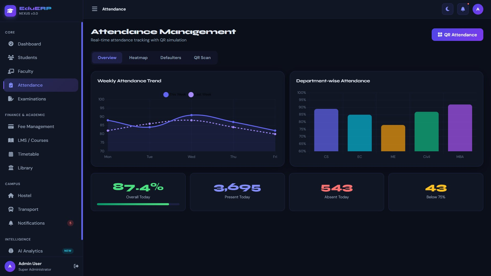
<br/><br/>

> **4 tabs** — Overview · Heatmap · Defaulters · QR Scan · Weekly trend line · Department bar chart · Live QR scanner simulation

</div>

<br/>

---

### 📝 Examination Module
<div align="center">
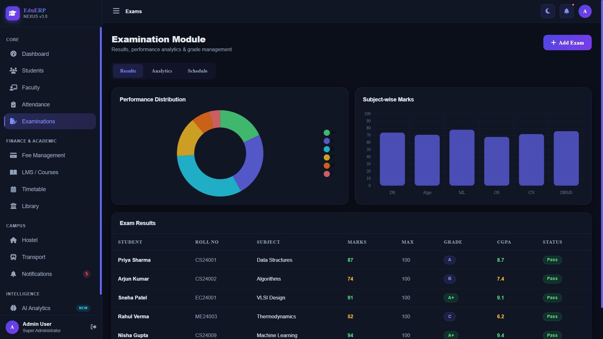
<br/><br/>

> **Performance distribution donut** · Subject-wise bar chart · Results table · CGPA distribution · Topper leaderboard · Exam schedule

</div>

<br/>

---

### 💰 Fee Management
<div align="center">
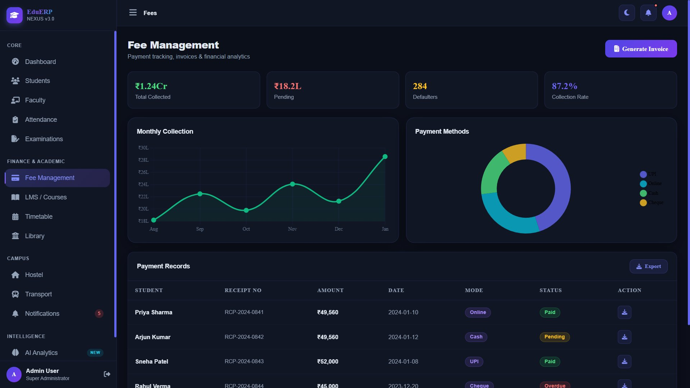
<br/><br/>

> **Monthly collection line chart** · Payment methods donut · Payment records table · Invoice generator modal · Export PDF

</div>

<br/>

---

### 📚 Learning Management System
<div align="center">
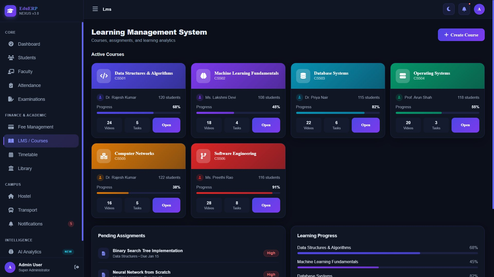
<br/><br/>

> **Colour-coded course cards** · Progress bars · Instructor info · Video & task counts · Pending assignments · Learning progress tracker

</div>

<br/>

---

### 🗓️ Timetable
<div align="center">
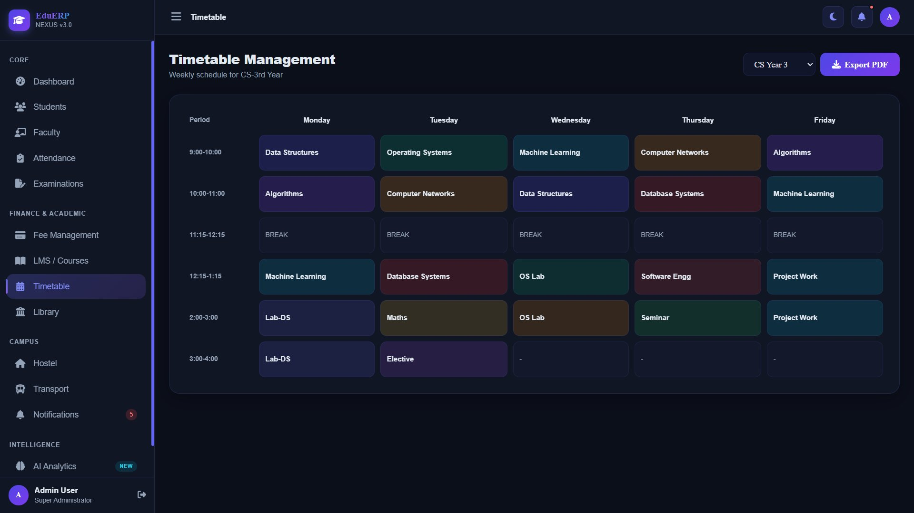
<br/><br/>

> **Colour-coded weekly grid** · Subject-specific colours · Break slots highlighted · Branch selector dropdown · Export PDF button

</div>

<br/>

---

### 📖 Library Management
<div align="center">
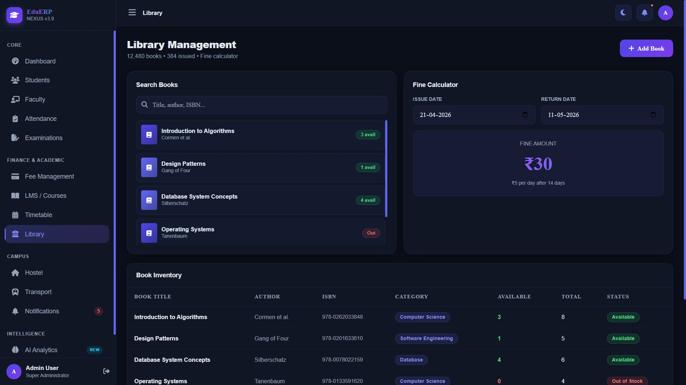
<br/><br/>

> **Live book search** · Availability badges · Fine calculator with date inputs · Book inventory table · Out-of-stock detection

</div>

<br/>

---

### 🏠 Hostel Management
<div align="center">
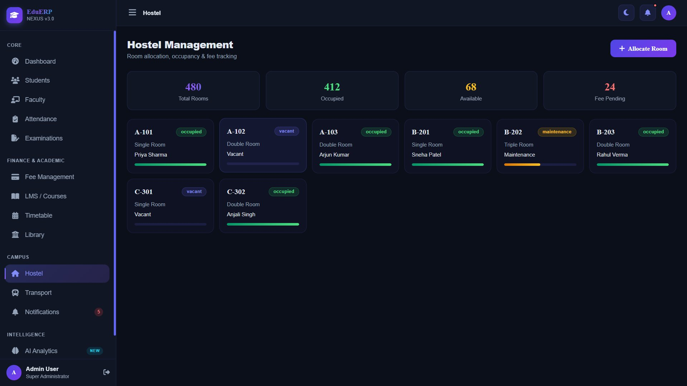
<br/><br/>

> **Room allocation cards** · Occupancy progress bars · Status badges (occupied / vacant / maintenance) · 4-metric KPI row

</div>

<br/>

---

### 🚌 Transport Management
<div align="center">
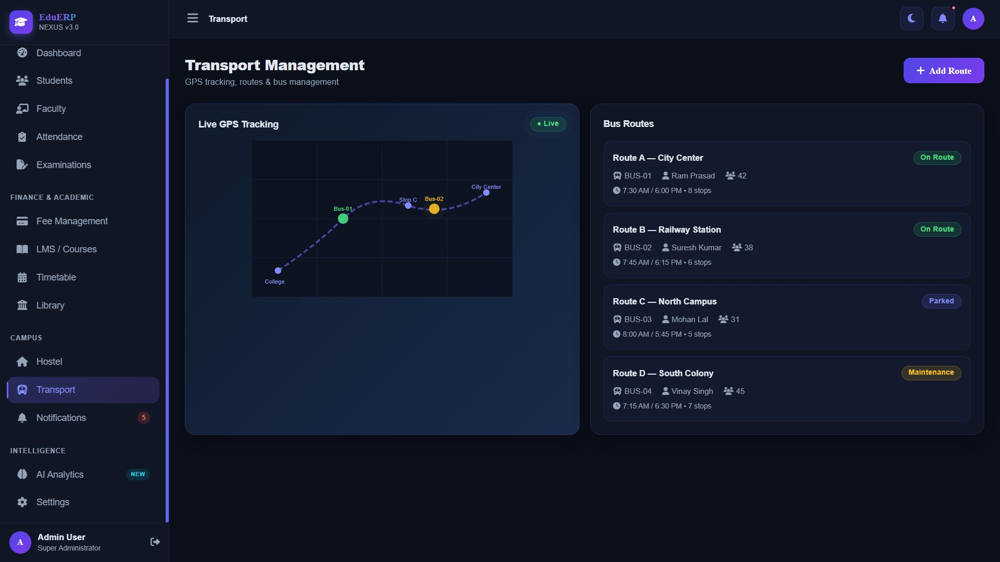
<br/><br/>

> **Animated SVG GPS map** · Live bus markers with pulse rings · Route list with driver, stop & timing details · Status badges

</div>

<br/>

---

### 🔔 Notifications & Announcements
<div align="center">
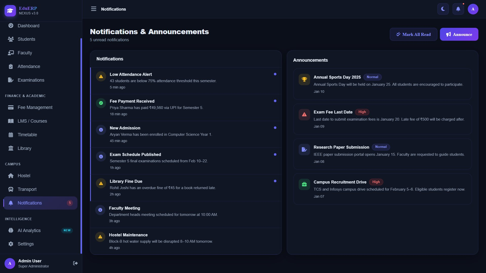
<br/><br/>

> **Unread indicator dots** · Mark-all-read · Priority badges · Announcement board · Multi-channel announce modal

</div>

<br/>

---

### 🤖 AI Analytics Dashboard
<div align="center">
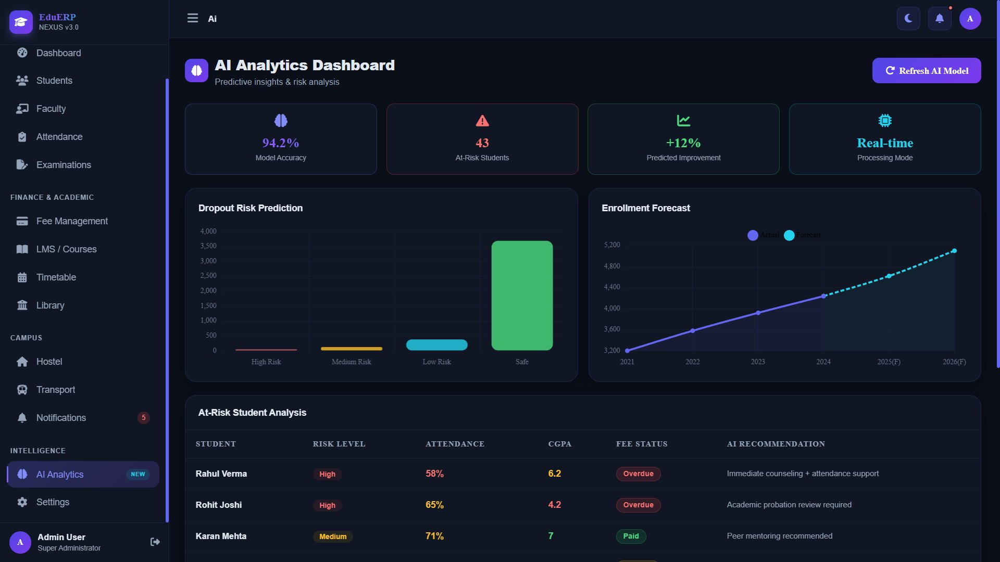
<br/><br/>

> **Dropout risk bar chart** · Enrollment forecast (actual + predicted) · At-risk student table with recommendations · Smart rec cards

</div>

<br/>

---

### ⚙️ Settings
<div align="center">
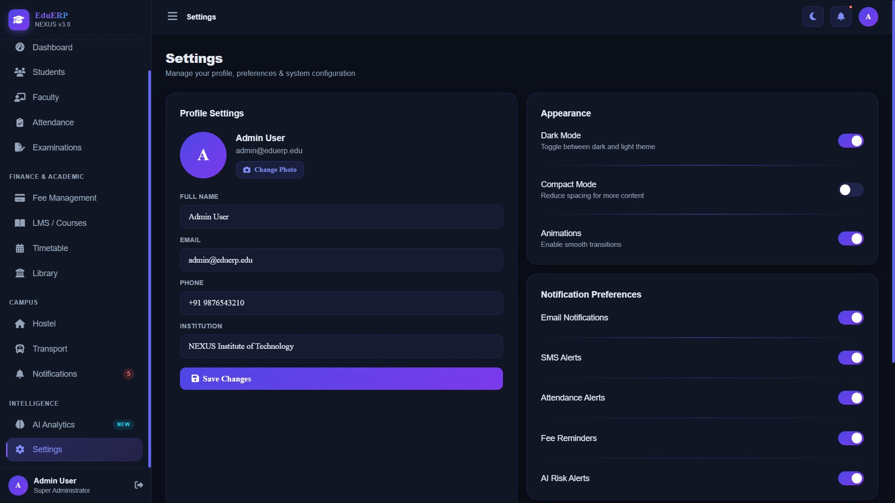
<br/><br/>

> **Profile settings form** · Toggle switches · Dark/light mode · Compact mode · Notification preferences · Password change

</div>

<br/>

---

<!-- ═══════════════════════════════════════ -->
## 🚀 Quick Start
<!-- ═══════════════════════════════════════ -->

### Option A — Direct Browser Launch

```bash
# 1. Clone the repository
git clone https://github.com/your-username/eduerp-nexus.git

# 2. Navigate to the folder
cd eduerp-nexus

# 3. Open in browser (no server needed!)
open EduERP-Nexus.html          # macOS
start EduERP-Nexus.html         # Windows
xdg-open EduERP-Nexus.html      # Linux
```

### Option B — VS Code Live Server

```bash
# Install Live Server extension in VS Code, then:
# Right-click EduERP-Nexus.html → "Open with Live Server"
```

### Option C — Python Local Server

```bash
python -m http.server 8080
# Then open → http://localhost:8080/EduERP-Nexus.html
```

### 🔑 Demo Credentials

| Role | Email | Password |
|------|-------|----------|
| 🛡️ Admin | `admin@eduerp.edu` | `admin123` |
| 👩‍🏫 Faculty | `faculty@eduerp.edu` | `admin123` |
| 👨‍🎓 Student | `student@eduerp.edu` | `admin123` |

> ✅ Any credentials work — it's a frontend demo!

---

<!-- ═══════════════════════════════════════ -->
## 📦 Module Breakdown
<!-- ═══════════════════════════════════════ -->

```
EduERP Nexus — 15 Modules
│
├── 🔐  Login          Role selector · Password toggle · Forgot password
├── 📊  Dashboard      KPIs · Charts · AI insights · Activity feed
├── 👨‍🎓  Students        CRUD table · Search/Filter · Pagination · Profile cards
├── 👩‍🏫  Faculty         Cards · Ratings · Subjects · Email actions
├── ✅  Attendance      Overview · Heatmap · Defaulters · QR Scanner
├── 📝  Examinations    Results · Analytics · Schedule · Toppers
├── 💰  Fee Mgmt        Records · Invoice · Charts · Payment methods
├── 📚  LMS             Courses · Assignments · Progress · Videos
├── 🗓️  Timetable       Weekly grid · Branch selector · Colour coding
├── 📖  Library         Search · Fine calc · Inventory · Availability
├── 🏠  Hostel          Room cards · Occupancy · Status tracking
├── 🚌  Transport       GPS SVG map · Routes · Driver info · Status
├── 🔔  Notifications   Alerts · Announcements · Mark-read · Badges
├── 🤖  AI Analytics    Risk chart · Forecast · Recommendations table
└── ⚙️  Settings        Profile · Theme · Notifications · Security
```

---

<!-- ═══════════════════════════════════════ -->
## 🎨 Design System
<!-- ═══════════════════════════════════════ -->

### Colour Palette

| Swatch | Name | Hex | Usage |
|--------|------|-----|-------|
| 🟣 | Indigo | `#6366f1` | Primary actions, active nav |
| 💜 | Violet | `#7c3aed` | Gradients, secondary |
| 🩵 | Cyan | `#06b6d4` | Highlights, charts |
| 💚 | Emerald | `#10b981` | Success, paid status |
| 🔴 | Red | `#ef4444` | Danger, overdue, alerts |
| 🟡 | Amber | `#f59e0b` | Warnings, pending |
| 🌑 | Dark BG | `#0b0f1a` | App background |
| 🌫️ | Card BG | `#111827` | Card surfaces |

### Typography

| Font | Weight | Usage |
|------|--------|-------|
| **Syne** | 700–800 | Headings, KPI numbers, brand |
| **DM Sans** | 300–600 | Body copy, labels, buttons |
| **JetBrains Mono** | 400 | Code, roll numbers |

### UI Primitives

```
Glassmorphism  →  backdrop-filter: blur(16px) + rgba background
Border Radius  →  12px cards · 99px badges/pills · 50% avatars
Animations     →  fadeSlideIn 0.35s · counter roll · pulse ring
Shadows        →  0 8px 32px rgba(0,0,0,0.35)
Transitions    →  0.3s cubic-bezier(0.4, 0, 0.2, 1)
```

---

<!-- ═══════════════════════════════════════ -->
## 🧠 AI Analytics Engine
<!-- ═══════════════════════════════════════ -->

```
┌─────────────────────────────────────────────────────────┐
│               AI Analytics — Feature Set                 │
├──────────────────────────┬──────────────────────────────┤
│  Model Accuracy          │  94.2%                       │
│  At-Risk Students        │  43 flagged with reasons     │
│  Predicted Improvement   │  +12% semester-over-semester │
│  Processing Mode         │  Real-time (simulated)       │
├──────────────────────────┴──────────────────────────────┤
│  Dropout Risk Prediction   ██ Bar Chart                 │
│  Enrollment Forecast       〰 Line + Dashed Forecast    │
│  At-Risk Table             Colour-coded Risk + Recs     │
│  Smart Recommendation Cards  6 actionable AI tips      │
└─────────────────────────────────────────────────────────┘
```

### Risk Classification Logic

| Risk Level | Attendance | CGPA | Fee Status |
|------------|-----------|------|------------|
| 🔴 High | < 65% | < 5.0 | Overdue |
| 🟡 Medium | 65–75% | 5–7 | Pending |
| 🟢 Low | 75–85% | 7–8 | Paid |
| ✅ Safe | > 85% | > 8 | Paid |

---

<!-- ═══════════════════════════════════════ -->
## 📊 Charts & Data Visualization
<!-- ═══════════════════════════════════════ -->

All charts rendered with **Chart.js** — fully responsive, animated on load.

| Chart | Type | Location |
|-------|------|----------|
| 📈 Revenue Analytics | Gradient Bar | Dashboard |
| 〰️ Attendance Trend | Smooth Line + Fill | Dashboard |
| 🍩 Department Distribution | Doughnut (cutout 70%) | Dashboard |
| 📉 Weekly Attendance | Multi-line (This vs Last) | Attendance |
| 🔵 Dept-wise Attendance | Coloured Bar | Attendance |
| 🍩 Grade Distribution | Doughnut | Examinations |
| 📊 Subject-wise Marks | Bar | Examinations |
| 📊 CGPA Distribution | Segmented Bar | Exam Analytics |
| 〰️ Monthly Fee Collection | Line + Fill | Fee Mgmt |
| 🍩 Payment Methods | Doughnut | Fee Mgmt |
| 📊 Dropout Risk | Bar | AI Analytics |
| 〰️ Enrollment Forecast | Dual Line (solid + dash) | AI Analytics |

---

<!-- ═══════════════════════════════════════ -->
## 🔧 Tech Stack
<!-- ═══════════════════════════════════════ -->

<div align="center">

| Technology | Version | Purpose |
|-----------|---------|---------|
|  | 5 | Structure & semantics |
|  | 3 | Custom glassmorphism styles |
|  | ES6+ | All interactivity & data |
|  | 3.x CDN | Utility classes |
|  | 4.x CDN | 12+ analytics charts |
|  | 6.5 CDN | 80+ icons |
|  | — | Syne + DM Sans |

</div>

> 🌐 **CDN-only** — no npm, no webpack, no build step. Just open the `.html` file.

---

<!-- ═══════════════════════════════════════ -->
## 📁 Project Structure
<!-- ═══════════════════════════════════════ -->

```
eduerp-nexus/
│
├── 📄  EduERP-Nexus.html          ← Single-file application (all-in-one)
│       ├── <style>                 CSS + Glassmorphism + Animations
│       ├── <body>                  Login + App Shell + 15 Page Sections
│       │    ├── #login-page        Animated login with role selector
│       │    ├── #app               Main app wrapper
│       │    │    ├── #sidebar      Collapsible navigation
│       │    │    ├── #topbar       Header with search/theme/bell
│       │    │    └── #main-content 15 page sections
│       │    └── Modals             Student · Faculty · Invoice · Announce
│       └── <script>               Mock data + All JS logic
│            ├── MOCK DATA          15 data arrays (students, faculty…)
│            ├── NAVIGATION         navigateTo(), toggleSidebar()
│            ├── CHART INIT         initDashboardCharts(), initAICharts()…
│            ├── CRUD               renderStudentsTable(), saveStudent()…
│            ├── THEME              toggleTheme(), applyTheme()
│            └── UTILITIES          showToast(), openModal(), calcFine()…
│
├── 📸  screenshots/
│    ├── ss_login.png
│    ├── ss_dashboard.png
│    ├── ss_students.png
│    ├── ss_faculty.png
│    ├── ss_attendance.png
│    ├── ss_exams.png
│    ├── ss_fees.png
│    ├── ss_lms.png
│    ├── ss_timetable.png
│    ├── ss_library.png
│    ├── ss_hostel.png
│    ├── ss_transport.png
│    ├── ss_notifications.png
│    ├── ss_ai.png
│    └── ss_settings.png
│
└── 📝  README.md                   ← You are here
```

---

<!-- ═══════════════════════════════════════ -->
## 🗺️ Roadmap
<!-- ═══════════════════════════════════════ -->

- [x] 15 module frontend prototype
- [x] Dark / Light mode with persistence
- [x] AI analytics dashboard
- [x] QR attendance simulation
- [x] GPS transport simulation
- [x] Animated counters & charts
- [ ] 🔜 REST API backend (Node.js / Django)
- [ ] 🔜 Real-time WebSocket notifications
- [ ] 🔜 PDF export for reports & invoices
- [ ] 🔜 Mobile PWA with offline support
- [ ] 🔜 Multi-language (i18n) support
- [ ] 🔜 Biometric attendance integration
- [ ] 🔜 Parent portal module
- [ ] 🔜 Placement cell module

---

<!-- ═══════════════════════════════════════ -->
## 🤝 Contributing
<!-- ═══════════════════════════════════════ -->

Contributions are welcome! Here's how to get started:

```bash
# 1. Fork the repository
# 2. Create your feature branch
git checkout -b feature/AmazingFeature

# 3. Commit your changes
git commit -m 'Add some AmazingFeature'

# 4. Push to the branch
git push origin feature/AmazingFeature

# 5. Open a Pull Request
```

### Contribution Guidelines

- Follow the existing code style (vanilla JS, clean functions, comments)
- Keep everything in the single HTML file
- Test on both dark and light modes
- Test responsive layout on mobile viewport

---

<!-- ═══════════════════════════════════════ -->
## 📄 License
<!-- ═══════════════════════════════════════ -->

```
MIT License

Copyright (c) 2026 EduERP Nexus

Permission is hereby granted, free of charge, to any person obtaining a copy
of this software and associated documentation files (the "Software"), to deal
in the Software without restriction, including without limitation the rights
to use, copy, modify, merge, publish, distribute, sublicense, and/or sell
copies of the Software, and is subject to the following conditions:

The above copyright notice and this permission notice shall be included in all
copies or substantial portions of the Software.
```

---

<!-- ═══════════════════════════════════════ -->
## 🏆 Use Cases
<!-- ═══════════════════════════════════════ -->

<div align="center">

| 🏫 Context | 💡 Application |
|-----------|----------------|
| **SIH Hackathon** | Full working prototype — demo-ready in minutes |
| **College Project** | Complete major project with 15 modules |
| **Startup MVP** | Frontend scaffold for EdTech SaaS product |
| **Enterprise Demo** | Boardroom-ready ERP presentation |
| **Portfolio Piece** | Showcase full-stack UI/UX capabilities |
| **Learning Resource** | Study glassmorphism, Chart.js & vanilla JS |

</div>

---

<!-- ═══════════════════════════════════════ -->
## 💬 Acknowledgements
<!-- ═══════════════════════════════════════ -->

<div align="center">

Built with these amazing open-source tools:

[Chart.js](https://www.chartjs.org) &nbsp;·&nbsp;
[Tailwind CSS](https://tailwindcss.com) &nbsp;·&nbsp;
[Font Awesome](https://fontawesome.com) &nbsp;·&nbsp;
[Google Fonts](https://fonts.google.com) &nbsp;·&nbsp;
[Shields.io](https://shields.io) &nbsp;·&nbsp;
[Capsule Render](https://github.com/kyechan99/capsule-render)

<br/>

---


**Made with 💜 for the future of education technology**

⭐ **Star this repo** if you found it useful! &nbsp;·&nbsp; 🐛 **Open an issue** for bugs &nbsp;·&nbsp; 🍴 **Fork** to build your own

<br/>


&nbsp;
[](https://github.com/your-username/eduerp-nexus)
&nbsp;
[](https://github.com/your-username/eduerp-nexus/fork)

</div>
